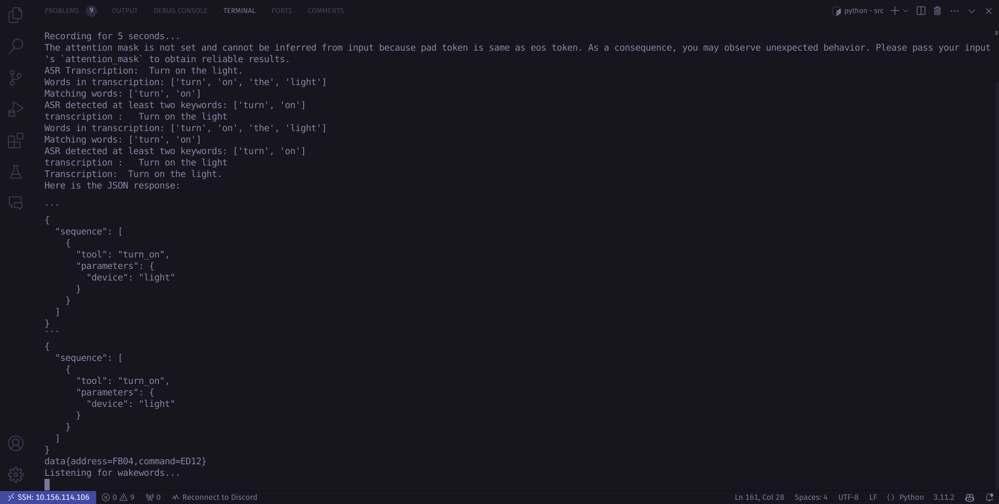

# Team Autobot
## Project Name: CircuitBot

### Description:
- Circuit Bot is an edge-based personal assistant for home automation. It integrates ASR (Automatic Speech Recognition) and a LLaMA model to interpret user voice commands. This system allows users to control BLE (Bluetooth Low Energy) appliances directly, eliminating the need for internet connectivity. The primary goal is to provide localized, low-latency control over home appliances with flexibility for users to code, customize, and manage appliances through both the assistant and an accompanying app.

#### Key Features:
**Voice-Controlled Automation:**
Circuit Bot uses on-device ASR to convert voice input into commands, making it fast and private.

**LLaMA-based NLP Engine:**
The LLaMA model processes and interprets the recognized speech, identifying user intent and mapping it to control actions.

**Bluetooth Low Energy (BLE) Appliance Control:**
All connected appliances (fans, lights, air conditioners, heaters, geysers, etc.) are managed using BLE protocols to ensure secure and low-power communication.

**Offline Functionality:**
Since Circuit Bot operates entirely on the edge, no internet connection is required for voice commands or appliance control.

**User-Customizable Devices and Commands:**
Users can program their own appliances and define specific commands through the assistant or mobile app, offering flexibility.

**Companion App:**
The mobile app provides a UI for configuration and management of devices, commands, and firmware updates.

**Hardware Requirements:**
Microcontroller/SoC:

ESP32 or ESP32-S3 (supports BLE, Wi-Fi, and TensorFlow Lite models)
At least 8 MB of PSRAM for running ASR and LLaMA models
Microphone Array/Module:

I2S MEMS Microphone (e.g., INMP441) for capturing audio input
Power Management:

Low dropout (LDO) regulators for stable voltage supply
Battery support (optional for portable assistant units)
Bluetooth Module (if external):

ESP32 has built-in BLE, but you could add an external BLE module if range needs improvement.
Speaker/Audio Output:

Class-D Amplifier (e.g., MAX98357) with a small speaker for audio feedback or notifications.
Storage:

External Flash Memory (e.g., 16 MB) for storing models, firmware, and user data
Display (Optional):

OLED or LCD screen for user interface feedback (e.g., status or error messages)
Sensors (Optional):

Temperature, humidity, or motion sensors to integrate with the home environment
Firmware Considerations:
Mutex-based management for reliable file operations across multiple devices.
ESP-ADF (Audio Development Framework) for handling voice input and output.
ESP-TFLite-Micro to run TensorFlow Lite models for speech recognition and natural language processing.
Low-latency BLE communication stack to control appliances efficiently.

### Team Members:
1. [Hariprasath](https://github.com/hari-110)
2. [HemanthSai7](https://github.com/HemanthSai7)
3. [JacobJebaraj001](https://github.com/jacobjebaraj001)
4. [spectakural](https://github.com/spectakural)

### Installation
```bash
pip install -r requirements.txt
```

### Usage
```bash
$ cd src
$ python detect_from_microphone.py --chunk_size 3000 --model_path models/dnn_circuit_bot_3.onnx
```


# Images
- Model JSON Response aka tool calling output 
